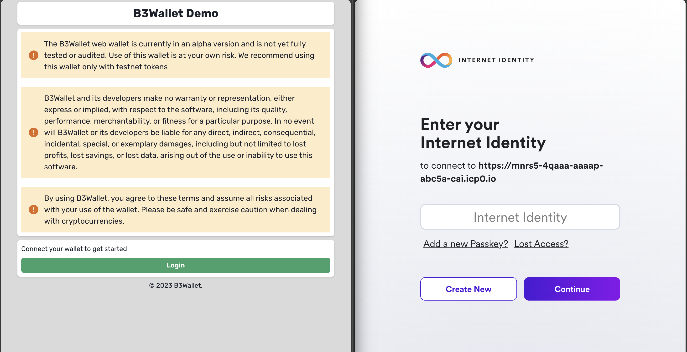

# B3Wallet - A MultiChain and MultiOwner Wallet

## Introduction

B3Wallet is a decentralized multi-chain and multi-owner wallet. It is designed to support multiple blockchains, including Bitcoin, Ethereum, and Internet Computer. It also supports multiple owners, including single owner, multi-owner, and multi-signature. In addition, it supports multiple accounts, including single account. Being decentralized, it does not rely on any centralized service and users can use it without any registration and recover it without any backup.

## Features

- Multiple blockchain support: Bitcoin, Ethereum, and Internet Computer
- Multiple owner support: single owner, multi-owner, and multi-signature
- Multiple account support: single account
- Decentralized: does not rely on any centralized service, users can use it without any registration and recover it without any backup.

# Demo


## Login:

To start, log in using your Internet Identity.



## Create Wallet:

You can create a wallet or use the UI anonymously.

To create a wallet, follow these steps:

1. Choose the wallet type: 'b3_basic_wallet' (single owner) or 'b3_wallet' (multi-signature).
2. You can create a new canister or use an existing one.

- - You can create your own canister using the NNS dApp. Once it's created, copy the canister ID into the input box.
- - Alternatively, you can use the 'Create' button to generate a new canister. As of now, this is free, but it may cost some cycles in the future.
- - If you're part of a multi-signature wallet, you can add a canister ID that's already been created by other users, and click Add Canister button.


## Add Account:

By default, the wallet creates an account for you. However, if you need more, you can add additional accounts. These accounts are derived from the same canister but utilize different indices.


## Multiple Signatures:

Wallets can have multiple signers, and users have the ability to add or remove signers. Once a signer is added, a 2/2 signature consensus is required for transaction approval. The logic operates on a 50%+1 basis, so if there are three signers, a 2/3 signature consensus is required for transaction approval.


## Self Custody:

B3Wallet provides self-custody functionality, meaning users maintain exclusive control over their canisters, and therefore, their funds. This decentralized approach to asset management aligns with the ethos of blockchain technology, enabling users to truly 'be their own bank'.


## Self Upgrade:

B3Wallet allows for self-upgrades, ensuring that you always have access to the latest features and security updates.


## Getting Started

Absolutely, I apologize for the confusion earlier. Here's a revised introduction:

# Custom Wallet Creation Libraries

Also there is three libraries to facilitate other developers in building their own wallets seamlessly. These libraries, located in the [lib directory](https://github.com/B3Pay/b3-wallet/tree/main/backend/lib), aim to streamline the wallet creation process and allow developers to customize a wallet that meets their unique needs.

## The Libraries:

- `b3_helper`: This foundational library provides core functionalities essential for every wallet. It equips developers with fundamental tools to initiate and manage various wallet operations.

- `b3_permit`: This library is designed to handle the authorization and permissions within the wallet. It simplifies the process of assigning and managing permissions for different wallet operations, enabling you to create wallets that support various levels of user access.

- `b3_wallet_lib`: This comprehensive library ties everything together and manages key aspects of wallet functionality. It handles account creation, key management, balance queries, and transfer processes for different blockchains and tokens. It also takes care of derivation processes, providing a versatile suite of wallet management tools. By using `b3_wallet_lib`, developers can interact with a clear and convenient interface, making the creation, management, and interaction with wallets a seamless experience.

By utilizing these libraries, developers can create customized wallets tailored to their specific needs and innovative concepts.

# Future Plans

I am considering the creation of a global wallet - a wallet that no one owns but everyone can sign. This revolutionary concept aims to bring the ethos of decentralization in blockchain technology to the next level. Stay tuned for more updates on this.

# Setting Up and Running B3Wallet Locally

Follow these instructions to set up and run the B3Wallet project on your local machine:

1. **Start the dfx service**: Open a terminal and run the following command:

```bash
yarn dfx:start
```

You can also run the command with the `--enable-bitcoin` flag if you want to enable Bitcoin:

```bash
yarn dfx:start --enable-bitcoin
```

2. **Install dfx**: While keeping the dfx service running, open another terminal and run:

```bash
yarn dfx:install
```

Similar to the previous step, you can also run the command with the `--enable-bitcoin` flag:

```bash
yarn dfx:install --enable-bitcoin
```

3. **Install project dependencies**: Install all the project dependencies with:

```bash
yarn install
```

4. **Deploy the project**: Deploy the project with:

```bash
yarn deploy
```

5. **Generate Candid and Types**: Generate the Candid interface and Typescript types for your canisters:

```bash
yarn generate
```

6. **Load the WASM module to system canister**: Load the WASM module to the system canister with:

```bash
yarn load-wasm:system
```

7. **Start the development server**: Finally, you can start the development server with:

```bash
yarn dev
```

All of these commands can also be run with npm by replacing `yarn` with `npm run` in each command.

Please make sure to have the necessary software installed and configured properly on your local machine before following these steps, including Node.js, Yarn (or npm), and DFINITY's SDK, dfx.
