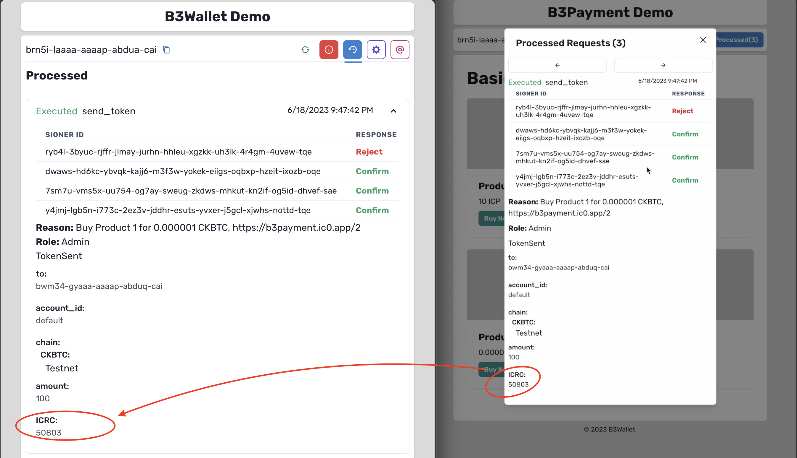

# Payment Demo

This is a simple payment top of the B3Wallet, a decentralized multi-chain, and multi-owner wallet. This payment system is specifically designed to enhance the versatility and usability of the B3Wallet, allowing users to perform transactions across multiple blockchains, including Bitcoin, Ethereum, and Internet Computer.

https://b7pqa-qqaaa-aaaap-abdva-cai.icp0.io/

## Key Features

- **Multi-chain transactions:** The B3 Payment System can handle transactions across a variety of blockchains, including but not limited to Bitcoin, Ethereum, and Internet Computer.

- **Support for multiple owners:** The system is designed to accommodate transactions from single owners, multiple owners, and even transactions requiring multi-signature approvals.

- **Decentralized:** In line with the ethos of blockchain technology, the payment system is fully decentralized. Users can use it without any registration and recover it without any backup.

- **Integration with B3 Wallet:** The B3 Payment System is built to seamlessly integrate with the B3 Wallet without needing login credentials or any other form of registration, providing users with a holistic solution for their crypto transaction needs.

## How it Works

User click on the Connect button to connect to the B3Wallet.

The B3Wallet will ask the user(s) to Confirm or Reject the connection.

Once the user confirms the connection, the B3Payment will be able to access the user's wallet information and query balances and account and request transactions, until user remove canister connection from the B3Wallet.

With this information the canister can query the user's account balance and display it on the screen without the user having to login or provide any other information.
Then the user can select the blockchain > account > token for buying products.
As soon as the user clicks on the Buy button, the B3Payment will send a request to the B3Wallet to sign the transaction.

And the B3Wallet will ask the user(s) to confirm or reject the transaction.
B3Payment keep track of the transaction status and display it on the screen.

Once the transaction is confirmed, selected tokens will be transferred to the seller's account, and callback will be called to check the transaction status using the block index.

## Getting Started

To get started with the B3 Payment System, please refer to the main README in the root of this repository for installation and setup instructions.
